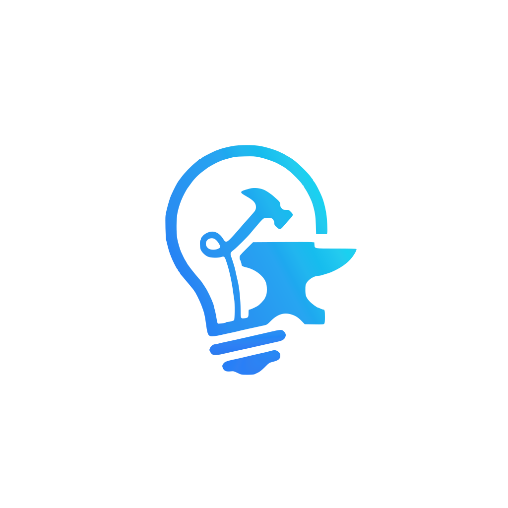

# IdeaForge 🚀

**Where Sparks Become Blueprints**

IdeaForge is a mobile application that allows users to submit startup ideas, receive a **mock AI-generated rating**, vote on ideas, and view leaderboards of top ideas — all using local storage (AsyncStorage).

---

## ✨ Features

### 🧾 1. Idea Submission
- Users can submit startup ideas with:
  - Startup Name
  - Tagline
  - Description
- On submission:
  - A **fake AI rating (0–100)** is randomly generated
  - Idea is stored locally using **AsyncStorage**
  - User is navigated to the Ideas screen

---

### 📜 2. Ideas Listing Screen (Home)
- Displays all submitted ideas stored locally
- Each idea shows:
  - Startup Name
  - Tagline
  - Mock AI Rating
  - Vote Count
- Features:
  - 👍 Upvote button (one vote per idea using AsyncStorage)
  - 📖 Expandable “Read More” for full description
  - 🔽 Sorting options (by rating or votes)

---

### 🏆 3. Leaderboard Screen
The leaderboard consists of two sections:

#### 🌍 Global Ideas (Mock Data)
- Displays **top 5 global ideas**
- Data is mock-generated
- Sorted by rating/votes

#### 👤 My Ideas
- Displays **top 3 user-created ideas**
- Based on locally stored AsyncStorage data
- Ranked by votes/ratings

---

### 👍 Voting System
- Users can upvote ideas
- Each idea supports **single vote per user**
- Vote state is stored in AsyncStorage

---

### 🎨 UI/UX Features
- Clean multi-screen mobile UI
- Bottom tab navigation
- Smooth transitions
- Gradient cards & modern design
- Dark mode support (optional)
- SnackBar/Toast Messages

---

## 📱 Screens

### 1. Submit Idea Screen
Create and submit startup ideas with instant mock evaluation.

### 2. Ideas Screen
Browse all created ideas, upvote, and explore details.

### 3. Leaderboard Screen
View:
- Top 5 global ideas (mock)
- Top 3 personal ideas (AsyncStorage-based)

---

## 🛠 Tech Stack

- React Native (Expo)
- TypeScript
- React Navigation
- React Native Paper
- AsyncStorage
- Lottie
- Expo Vector Icons

---

## 💾 Data Handling

All app data is stored locally using AsyncStorage:

- Ideas list
- Votes per idea
- User-created ideas
- Mock ratings
